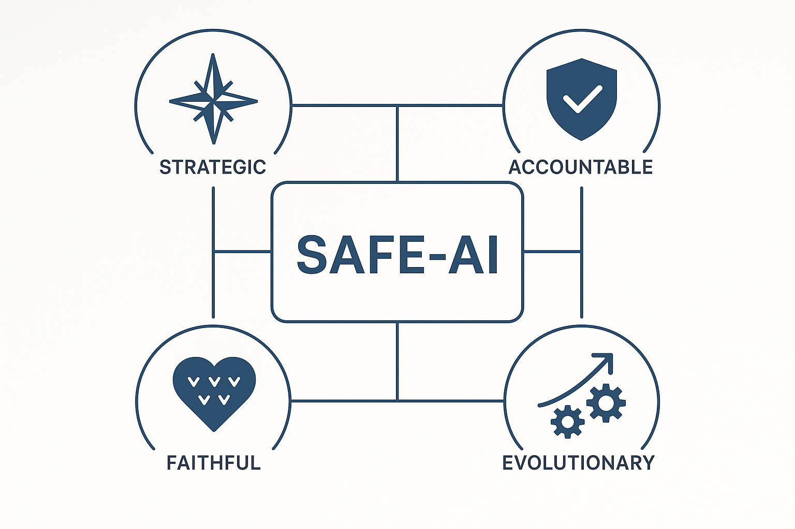

# AI-Governance-Strategy-Portfolio
A portfolio of proprietary frameworks and applied research on AI Governance, Risk, and Strategy. By Yeison R.S.
# Yeison R.S. | Laboratorio di Ricerca Applicata in AI Governance & Strategy
Specialista in AI Governance con un approccio unico alla trasformazione del Rischio e della Compliance in vantaggio competitivo. Questo portfolio raccoglie framework proprietari e analisi applicate, progettati per aiutare le organizzazioni a navigare la complessità dell'IA generativa, garantendo un'adozione sicura, etica e profittevole. Il mio lavoro si focalizza sul disegno di modelli di governance end-to-end, in linea con normative come l'EU AI Act.

Le aziende oggi affrontano una sfida critica: come sfruttare la potenza dell'IA generativa senza esporsi a rischi reputazionali, legali e operativi. La mancanza di un approccio strutturato porta a un'adozione lenta, a incidenti costosi e a una perdita di vantaggio competitivo.

La mia metodologia si basa su un ecosistema integrato che copre l'intero ciclo di vita del rischio AI:
1. Governance Proattiva: Costruire l'eccellenza per prevenire le crisi.
2. Gestione Reattiva: Trasformare una crisi inevitabile in un'opportunità di leadership.

## 1. Governance Proattiva: Il Framework SAFE-AI
Un framework olistico per implementare l'IA Generativa in modo responsabile e profittevole, posizionando l'etica come acceleratore di innovazione.

### Principali Componenti:

- **Pilastri Strategici:** Definizione dei 4 pilastri del framework: Strategic, Accountable, Faithful, Evolutionary .

- **Principi Operativi:** Policy non negoziabili come "Human-in-Command" e "Fortezza dei Dati".

- **Analisi ROI:** Un business case dettagliato che proietta un ROI del 656% a 3 anni, dimostrando il valore economico della governance.

- **Percorso di Certificazione Interna:** Un programma di training a 3 livelli (Bronze, Silver, Gold) per creare competenze interne.
➡️ **[Esplora i dettagli del Framework SAFE-AI](./SAFE-AI_Framework/README.md)**

## 2. Gestione Reattiva: L'Ecosistema P.R.I.A.
Un protocollo completo per la gestione delle crisi AI, basato sulla filosofia "Fail Fast, Recover Faster, Learn Fastest"

### Componenti dell'Ecosistema:

- **Protocollo P.R.I.A.:** Strategia di risposta strutturata con una scala di gravità a 5 livelli (DEFCON-AI) e una timeline di reazione critica .

- **Checklist Operative:** Guide procedurali dettagliate per ogni ruolo del Crisis Team, dal CEO al CTO, per garantire un'esecuzione impeccabile .

- **Framework di Metriche:** Un sistema di KPI per misurare l'efficacia della risposta (es. Time to Detection, Total Cost of Incident) .

- **Template di Comunicazione:** Modelli pre-approvati per comunicare con media, clienti e autorità, garantendo coerenza e professionalità .

➡️ **[Esplora i dettagli dell'Ecosistema P.R.I.A.](./PRIA_Incident_Response_Ecosystem/README.md)**

## 3. Case Study: Progetto di Validazione

Applicazione pratica del framework SAFE-AI per analizzare il posizionamento strategico e il profilo di rischio AI di un'azienda leader di mercato.

➡️ **[Leggi l'analisi su Azienda X](./Case-Studies_Applicati/Analisi_SAFE-AI_FERRARI/README.md)**
