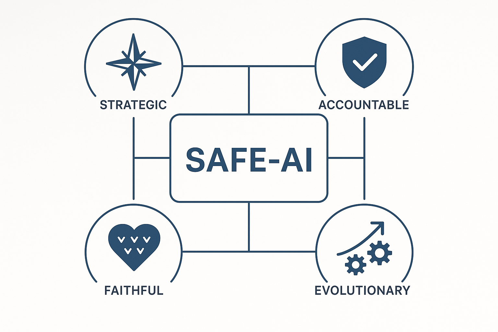

# Framework SAFE-AI: Architettura per il Vantaggio Competitivo Responsabile

## Obiettivo Strategico
[cite_start]Il framework SAFE-AI è un sistema di governance olistico progettato per trasformare l'adozione dell'Intelligenza Artificiale Generativa da potenziale rischio operativo a vantaggio competitivo sostenibile[cite: 10]. [cite_start]L'obiettivo è creare un ecosistema aziendale dove l'innovazione prospera all'interno di confini etici chiari, generando valore misurabile per l'organizzazione, i dipendenti e i clienti[cite: 10, 11].

---

## I 4 Pilastri del Framework
[cite_start]L'architettura concettuale si basa su quattro pilastri fondamentali che formano l'acronimo SAFE[cite: 42, 43]:

* [cite_start]**S - STRATEGICO (Strategic Alignment):** Ogni iniziativa AI deve servire gli obiettivi di business strategici e avere un ROI chiaramente definito e misurabile[cite: 45, 46]. [cite_start]Non deve mai diventare fine a se stessa[cite: 45].
* [cite_start]**A - AFFIDABILE (Accountable):** Ogni output generato dall'AI ha un responsabile umano identificabile e tracciabile[cite: 49]. [cite_start]Vengono implementati protocolli di validazione umana per le decisioni critiche e un audit trail completo per la compliance[cite: 50].
* [cite_start]**F - FEDELE (Faithful to Values):** L'uso dell'AI deve riflettere e rafforzare i valori fondamentali dell'azienda[cite: 53]. [cite_start]Questo viene garantito tramite l'integrazione dei valori nei processi, valutazioni etiche sistematiche e training continuo[cite: 54].
* [cite_start]**E - EVOLUTIVO (Evolutionary):** Il framework è un organismo vivente, progettato per adattarsi dinamicamente all'evoluzione della tecnologia e delle normative attraverso revisioni trimestrali e un monitoraggio proattivo[cite: 57, 58].

---

## Componenti Chiave e Deliverable
Il framework non è solo teoria, ma si traduce in una serie di strumenti operativi e policy concrete:

* [cite_start]**Principi Operativi Non Negoziabili:** Include policy fondamentali come **"Human-in-Command"**, che garantisce il controllo umano strategico, e la **"Fortezza dei Dati"**, un sistema di classificazione rigoroso per proteggere le informazioni sensibili[cite: 64, 68, 84].
* [cite_start]**Zone di Eccellenza:** Definisce le aree in cui l'AI può creare il massimo vantaggio competitivo, come l'**Accelerazione Creativa** (Brainstorming 10X, Prototipazione Rapida) e l'**Intelligenza Aumentata** (Analisi Multi-Prospettiva, Pattern Recognition)[cite: 122, 125, 135, 145].
* [cite_start]**Confini Operativi Invalicabili:** Stabilisce "Zone Rosse" con tolleranza zero, come il "Muro della Privacy", la "Delega Totale" su aree critiche (es. Risorse Umane, Finanza), la "Trappola del Plagio" e il "Vicolo Cieco Etico" [cite: 188-210].
* [cite_start]**Governance a Tre Livelli:** Implementa una struttura di controllo che coinvolge l'**Auto-Governance** individuale, la **Peer Review** a livello di team e un **AI Ethics Committee** a livello organizzativo [cite: 212-225].
* [cite_start]**Percorso di Certificazione Interna:** Un programma di training strutturato su 3 livelli (Bronze, Silver, Gold) per creare e certificare le competenze AI all'interno dell'organizzazione, garantendo un'adozione consapevole e omogenea [cite: 347-402].

---

## L'Impatto di Business: Analisi ROI
La governance etica non è un costo, ma un investimento strategico. Il framework include un business case dettagliato che quantifica i benefici attesi.

| Periodo | Investimenti | Benefici | ROI Cumulativo |
| :--- | :--- | :--- | :--- |
| 0-3 mesi | €500,000 | €131,250 | -74% |
| 3-12 mesi | €200,000 | €1,968,750 | **+181%** |
| 12+ mesi | €200,000 | €5,000,000 | **+656%** |

*Dati basati sull'analisi Costi-Benefici dettagliata nel documento completo. [cite_start]Payback period stimato: 8 mesi. [cite: 492, 493]*

---

### ➡️ **[Consulta il Framework SAFE-AI Completo (PDF)](./Framework_SAFE-AI_Completo.pdf)**
